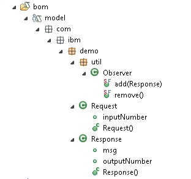

Table of Contents

1. [Introduction](#intro)
2. [Version(s) Supported](#versions)
3. [Usage Instructions](#instruction)
4. [Details](#details)
5. [License information](#license)

Introduction
============

This document provides an example implementation of a 
<a href="https://www.ibm.com/support/knowledgecenter/en/SSQP76_8.7.0/com.ibm.odm.dserver.rules.ref.designer/html/api/html/com/ibm/rules/engine/observer/Observable.html">Rule Engine Observer</a>. The code is provided and can be extended as needed. An Observer is used to receive notifications from an Observable object (You can use it for additional logging for instance).

You can import this sample into an existing rule Designer or decision Center to View.

Version(s) Supported
====================

IBM ODM 8.7 or greater

Usage Instructions
===================

1. Import into decision Center (or rule Designer).
2. Update the deployment configuration to include your Rule Execution Server (RES). 
3. Deploy to the RES.
4. Log onto the RES instance and navigate to the ruleapp "MyTest" in the explorer tab. Open up ruleset "runRules". 
5. Retreive HTDS description file, select REST, format WADL, and Test.
6. Click on "Execute Request"; you will see trace messages in the response printed by our observer.

Details
============

### Inside the Main Rule Project (TestObserver-service):

#### Rules:

This project has a few sample rules (rule "RuleA", and decision Table "RuleB"). These are filler rules, just created so that there are rules to run in the ruleflow.

#### Ruleflow ("Main flow"):

At the beginning, this calls the BOM method add with the created response as the parameter, then runs the rules, and finally calls the BOM method remove to remove the observer during cleanup.

#### Variables:

Just used for input and output parameters.

#### BOM:

In the BOM, we have a virtual class called Observer which is not verbalized (so that it is not seen by business users).

Observer has two BOM method's defined; "add(Response)" and "remove()". The code is implemented in the functions' B2X which make them virtual.

+ Add takes a Response object, and creates/adds a new EngineObserverDE with a new trace. 
+ Remove gets the list of observers that have been added to the engine, searches for any with the class "EngineObserverDE", and removes them.

#### Deployment:

There is a decision operation "TestObserverOperation", which defines that a request is required for input, and a response is given on output. There is also a deployment configuration which defines the target RES instance.

### Inside the XOM project (TestObserver-xom):

#### Request Class:

The Request class contains a date, and an input number.

#### Response Class:

The response class contains an outout number, a string message, and stores the EngineTrace.

#### TraceElement:

This is esentially a wrapper for a String message. An EngineTrace contains a list of TraceElement messages that were created when the observer was sent a notification by the engine.

#### EngineTrace:

This class contains/stores a list of TraceElements. There are also three attributes that can be configured.
+ traceRules - set true to get notified before/after a RuleAction is executed, or when an exception is raised in a rule.
+ traceRuleFlows - set true to get notified before/after a flow is executed. A flow is either the execution of a single rule task or function, or the execution of a flow task. 
+ traceAgenda - set true to get notified when a RuleInstance is updated or added/removed from the agenda.

It is important to include an xml annotation so that the EngineTrace is printed in HTDS. When the observer is notified of something by the engine, a TraceElement with a message is added to this EngineTrace.

#### EngineObserverDE:

This class implements three children of Observer: 
+ <a href="https://www.ibm.com/support/knowledgecenter/en/SSQP76_8.7.0/com.ibm.odm.dserver.rules.ref.designer/html/jrules2dotnet/html/T_IBM_Rules_RVE_RuleDef_Runtime_RuleEngineObserver.htm">RuleEngineObserver</a> - Shows notifications for RuleExecutionStarted, RuleExecutionEnded, ExceptionRaisedInAction, and ExceptionRaisedInCondition

+ <a href="https://www.ibm.com/support/knowledgecenter/en/SSQP76_8.7.0/com.ibm.odm.dserver.rules.ref.designer/html/jrules2dotnet/html/T_IBM_Rules_RVE_Ruleflow_Runtime_RuleflowObserver.htm">RuleflowObserver</a> - Shows notifications for RuleFlowStarted, RuleFlowEnded, TaskStarted, and TaskEnded

+ <a href="https://www.ibm.com/support/knowledgecenter/en/SSQP76_8.7.0/com.ibm.odm.dserver.rules.ref.designer/html/jrules2dotnet/html/T_IBM_Rules_RVE_RuleDef_Runtime_AgendaObserver.htm">AgendaObserver</a> - Shows notifications when a RuleInstance is updated or added/removed from the agenda.

This class overrides the required methods for these interfaces. When an engine notification event occurs, this class adds a TraceElement to its EngineTrace.

License Information
====================
The files found in this project are licensed under the [Apache License 2.0](LICENSE).

# Notice
© Copyright IBM Corporation 2019.
